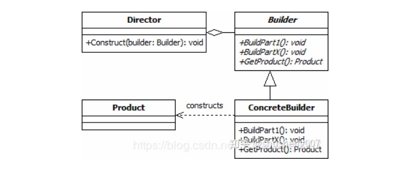

### 建造者模式

建造者模式（Builder Pattern）使用多个简单的对象一步一步构建成一个复杂的对象。这种类型的设计模式属于创建型模式，它提供了一种创建对象的最佳方式。一个 Builder 类会一步一步构造最终的对象。该 Builder 类是独立于其他对象的。

**意图：** 将一个复杂的构建与其表示相分离，使得同样的构建过程可以创建不同的表示。

**主要解决：** 主要解决在软件系统中，有时候面临着"一个复杂对象"的创建工作，其通常由各个部分的子对象用一定的算法构成；由于需求的变化，这个复杂对象的各个部分经常面临着剧烈的变化，但是将它们组合在一起的算法却相对稳定。

**何时使用：** 一些基本部件不会变，而其组合经常变化的时候。

**如何解决：** 将变与不变分离开。

**关键代码：** 
- Product: 最终要生成的对象，例如 Computer实例。
- Builder： 构建者的抽象基类（有时会使用接口代替）。其定义了构建Product的抽象步骤，其实体类需要实现这些步骤。其会包含一个用来返回最终产品的方法Product getProduct()。
- ConcreteBuilder: Builder的实现类。
- Director: 决定如何构建最终产品的算法. 其会包含一个负责组装的方法void Construct(Builder builder)， 在这个方法中通过调用builder的方法，就可以设置builder，等设置完成后，就可以通过builder的 getProduct() 方法获得最终的产品。

**应用实例：** 
- 1、去肯德基，汉堡、可乐、薯条、炸鸡翅等是不变的，而其组合是经常变化的，生成出所谓的"套餐"。 
- 2、JAVA 中的 StringBuilder。

**优点：** 
- 1、建造者独立，易扩展。 
- 2、便于控制细节风险。

**缺点：** 
- 1、产品必须有共同点，范围有限制。 
- 2、如内部变化复杂，会有很多的建造类。

**使用场景：** 
- 1、需要生成的对象具有复杂的内部结构。 
- 2、需要生成的对象内部属性本身相互依赖。

**注意事项：** 与工厂模式的区别是：建造者模式更加关注与零件装配的顺序。

###自己理解
要创建一个复杂的对象的时候，往往有很多组件（往往由默认实现）。这是要构建这个对象，如果用setter会导致其
一定会对外暴露修改组件的方法。用构造方法，由于由默认实现的组件可不需要参数，会导致构造方法要重载很多次才
符合要求。而用builder模式可以一步一步确定组件，不传就使用默认实现，最终调用复杂对象的全参构造一次性创、
造出对象。