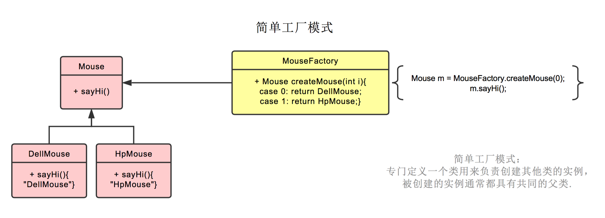
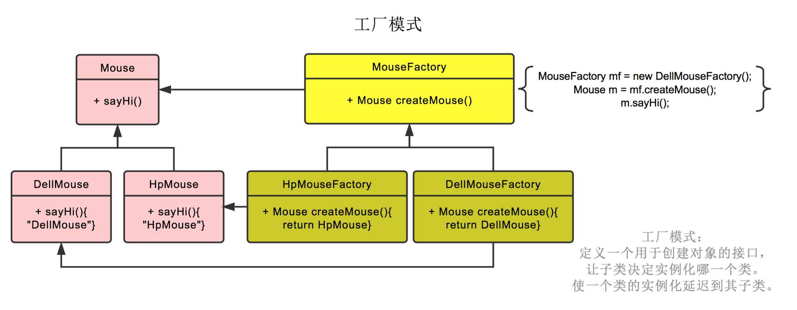
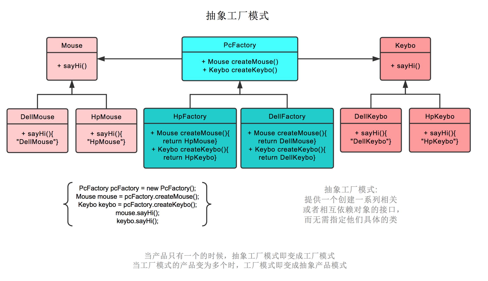
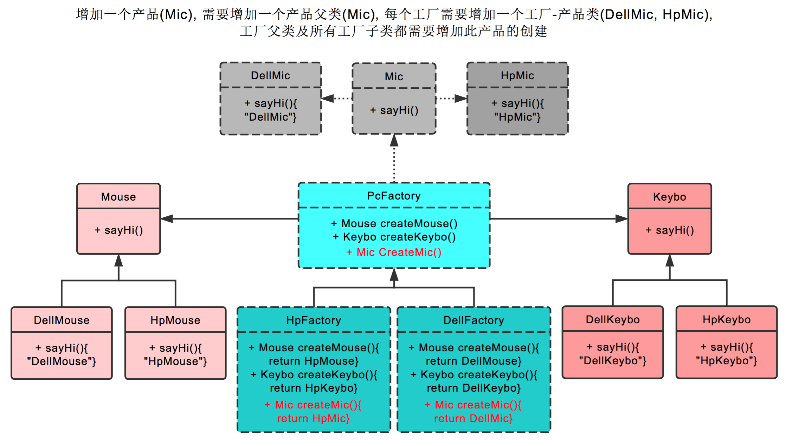

###简单工厂模式
不是 23 种里的一种，简而言之，就是有一个专门生产某个产品的类。
比如下图中的鼠标工厂，专业生产鼠标，给参数 0，生产戴尔鼠标，给参数 1，生产惠普鼠标。

###工厂模式
工厂模式也就是鼠标工厂是个父类，有生产鼠标这个接口。
戴尔鼠标工厂，惠普鼠标工厂继承它，可以分别生产戴尔鼠标，惠普鼠标。
生产哪种鼠标不再由参数决定，而是创建鼠标工厂时，由戴尔鼠标工厂创建。
后续直接调用鼠标工厂.生产鼠标()即可

###抽象工厂模式
抽象工厂模式也就是不仅生产鼠标，同时生产键盘。
也就是 PC 厂商是个父类，有生产鼠标，生产键盘两个接口。
戴尔工厂，惠普工厂继承它，可以分别生产戴尔鼠标+戴尔键盘，和惠普鼠标+惠普键盘。
创建工厂时，由戴尔工厂创建。 后续 **工厂.生产鼠标()** 则生产戴尔鼠标，工厂.生产键盘()则生产戴尔键盘。

- **在抽象工厂模式中，假设我们需要增加一个工厂**
假设我们增加华硕工厂，则我们需要增加华硕工厂，和戴尔工厂一样，继承 PC 厂商。
之后创建华硕鼠标，继承鼠标类。创建华硕键盘，继承键盘类即可。
  
- **在抽象工厂模式中，假设我们需要增加一个产品**
假设我们增加耳麦这个产品，则首先我们需要增加耳麦这个父类，再加上戴尔耳麦，惠普耳麦这两个子类。
之后在PC厂商这个父类中，增加生产耳麦的接口。最后在戴尔工厂，惠普工厂这两个类中，分别实现生产戴尔耳麦，惠普耳麦的功能。 以上。
  

