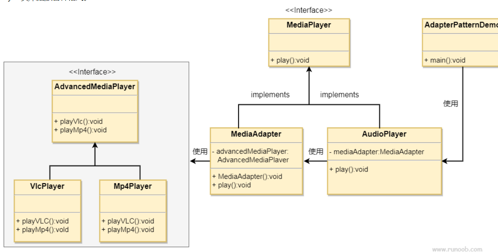

### 适配器模式

**何时使用：** 
- 1、系统需要使用现有的类，而此类的接口不符合系统的需要。 
- 2、想要建立一个可以重复使用的类，用于与一些彼此之间没有太大关联的一些类，包括一些可能在将来引进的类一起工作，这些源类不一定有一致的接口。 
- 3、通过接口转换，将一个类插入另一个类系中。

**如何解决：** 继承或依赖（推荐）。

**关键代码：** 适配器继承或依赖已有的对象，实现想要的目标接口。

**优点：**

- 1、可以让任何两个没有关联的类一起运行。
- 2、提高了类的复用。
- 3、增加了类的透明度。
- 4、灵活性好。

**缺点：**

- 1、过多地使用适配器，会让系统非常零乱，不易整体进行把握。比如，明明看到调用的是 A 接口，其实内部被适配成了 B 接口的实现，一个系统如果太多出现这种情况，无异于一场灾难。因此如果不是很有必要，可以不使用适配器，而是直接对系统进行重构。
- 2.由于 JAVA 至多继承一个类，所以至多只能适配一个适配者类，而且目标类必须是抽象类。

**使用场景：** 有动机地修改一个正常运行的系统的接口，这时应该考虑使用适配器模式。

**注意事项：** 适配器不是在详细设计时添加的，而是解决正在服役的项目的问题。

###自己的理解：
接口B适配接口A：就是要实现要适配的接口A，接口A实现依赖于原来的接口B的实现，
可以通过继承或依赖的方式获得接口B实现类的方法调用。总之适配器类要实现接口A（才能被用户调用），
这个类可以依赖或继承接口B的实现类，从而动用B实例的方法实现A接口。