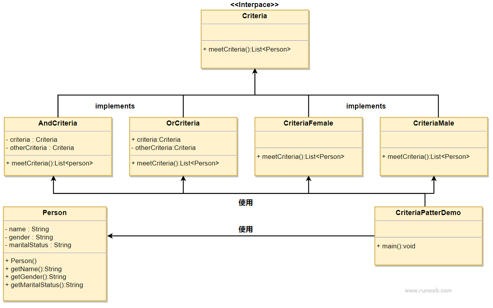

### 过滤器模式

过滤器模式（Filter Pattern）或标准模式（Criteria Pattern）是一种设计模式，这种模式允许开发人员使用不同的标准来过滤一组对象，通过逻辑运算以解耦的方式把它们连接起来。这种类型的设计模式属于结构型模式，它结合多个标准来获得单一标准。

### 自己理解
设计一个过滤接口，过滤方法的入参和参都是一组元素的集合。这样上一个方法的返回可以作为下一
个方法的入参。组合不同的实现可以构造不同的实现。注意逻辑过滤器的构造方法，是要传入两个过滤器的。